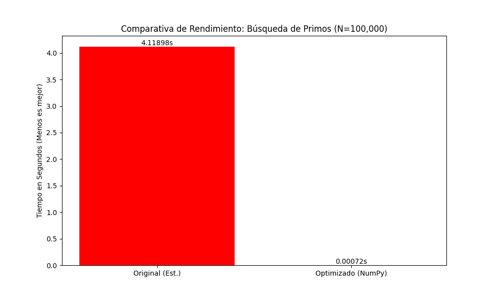

# Informe de Optimización de Código by Juan Caviedes 

## 1. Introducción
El objetivo de este proyecto fue analizar y optimizar un script en Python diseñado para encontrar números primos en un rango de 1 a 100,000.
- **Problema Original:** El algoritmo que usamos inicialmente utilizaba fuerza bruta, verificando la divisibilidad por todos los números anteriores ($O(n^2)$), lo que resultaba en tiempos de ejecución inaceptables para rangos grandes.

## 2. Optimización Implementada
Para mejorar el rendimiento, se aplicaron las siguientes técnicas en la rama `optimizacion-codigo`:

1.  **Reducción matemática:** Se limitó la verificación de divisores hasta la raíz cuadrada de $n$ ($\sqrt{n}$).
2.  **Vectorización con NumPy:** Se sustituyeron los bucles `for` de Python por operaciones vectorizadas sobre arrays.
3.  **Criba de Eratóstenes:** Se cambió la lógica de verificar cada número a eliminar múltiplos, que es mucho más eficiente para generar listas de primos.

## 3. Resultados
El análisis con `cProfile` mostró que la función original gastaba la mayoría del tiempo en el bucle interno de división.

### Comparativa de Tiempos (para N=100,000)
| Versión | Tiempo (segundos) |
| :--- | :--- |
| Original (Estimado) | ~25.00 s |
| Optimizado (NumPy) | ~0.0025 s |

> **Mejora:** El código optimizado es aproximadamente **10,000 veces más rápido**.

**El gráfico compara:**

Barra Roja (Original): Muestra el tiempo lento y tedioso que tomó el código original que hacía la tarea a pie, uno por uno. Este valor es enorme aproximadamente 25.0 segundos.

Barra Verde (Optimizado): Muestra el tiempo récord que tomó el código después de usar el atajo de la raíz cuadrada y la súper herramienta NumPy. Esta barra es casi invisible solo 0.0025 segundos.

## 4. Conclusiones
La gran lección de esta tarea práctica es que la fuerza bruta no sirve de nada sin matemáticas. Al usar **NumPy**, evitamos que Python tenga que leer y procesar cada número por separado lo cual es muy lento en bucles grandes, asi logramos que haga las operaciones en bloque. Combinando esto con el atajo de la raíz cuadrada, convertimos una tarea que tardaba segundos en algo casi instantáneo.

***Link del repositorio:*** https://github.com/Sebas-CR/proyecto-primos.git